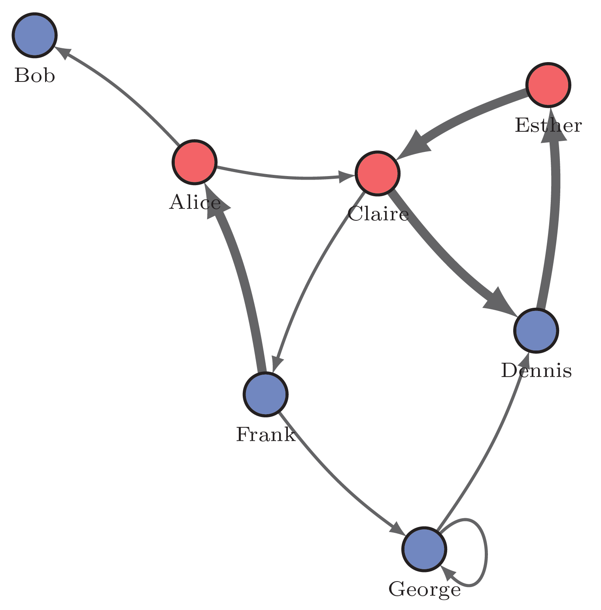
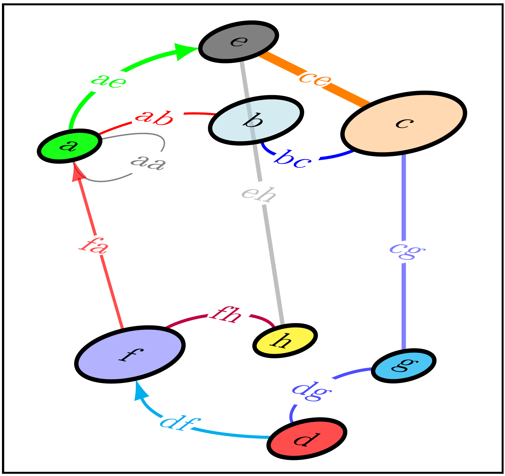

# TikZ

[TikZ](https://www.overleaf.com/learn/latex/TikZ_package) is a popular package for creating data visualizations in LaTeX. It also allows for graph and network visualizations. In 2018, Jürgen Hackl published the [TikZ-network](https://ctan.org/pkg/tikz-network?lang=en) extension, which simplifies the creation of network images ([GitHub](https://github.com/hackl/tikz-network), [Manual](https://mirror.szerverem.hu/ctan/graphics/pgf/contrib/tikz-network/tikz-network.pdf)). 

With TikZ, we can construct a picture of a given network from individual components - nodes, links, labels using the `\vertex`, `\edge` and `\text` commands. However, it is much easier to prepare a description of the network picture in two tables that also contain image specifications - a node table and a link table. These tables are saved as CSV files.

## Simple example

`TikZnodes.csv` - [node table](./TeX/data/TikZnodes.csv) 
```
id,x,y,size,color,opacity,label,position
a,2.868,5.518,0.5,red,0.7,Alice,below
b,1.000,7.000,0.5,blue,0.7,Bob,below
c,5.006,5.387,0.5,red,0.7,Claire,below
d,6.858,3.552,0.5,blue,0.7,Dennis,below
e,7.000,6.419,0.5,red,0.7,Esther,below
f,3.698,2.808,0.5,blue,0.7,Frank,below
g,5.551,1.000,0.5,blue,0.7,George,below
```

`TikZlinks.csv` - [link table](./TeX/data/TikZlinks.csv)
```
u,v,lw,bend,Direct
a,b,1.0,-8.531,true
a,c,1.0,-8.531,true
c,d,3.0,-8.531,true
d,e,3.0,-8.531,true
e,c,3.0,-8.531,true
c,f,1.0,-8.531,true
f,a,3.0,-8.531,true
f,g,1.0,-8.531,true
g,g,1.0,-8.531,true
g,d,1.0,-8.531,true
```

```
\documentclass{article}
\usepackage{tikz-network}
\begin{document}
\begin{tikzpicture}
\Vertices{data/TikZnodes.csv}
\Edges{data/TikZlinks.csv}
\end{tikzpicture}
\end{document}
```



[PNG](./pics/TikZvis1.png); [PDF](./pics/TikZvis1.pdf)

## Interactive version

```
\documentclass{article}
\usepackage[utf8]{inputenc}
\usepackage{tikz-network}
\begin{document}
\typeout{Network visualization}
\typein[\nodesFile]{Enter nodes file name!}
\typein[\linksFile]{Enter links file name!}
\noindent\textbf{TikZvisInt}: \today\\ 
nodes=\texttt{\nodesFile}, links=\texttt{\linksFile}\\[12pt]
\begin{tikzpicture}
\Vertices{\nodesFile}
\Edges{\linksFile}
\end{tikzpicture}
\end{document}
```
[LaTeX](./TeX/TikZvisInt.tex); [PDF](./pics/TikZvisInt.pdf)
## Multi-layer networks
TikZ also supports multi-layer networks. For example: [nodes](./TeX/data/TikZnodesML.csv), [links](./TeX/data/TikZlinksML.csv).
```
\documentclass{article}
\usepackage{tikz-network}
\begin{document}
\fbox{
\begin{tikzpicture}[multilayer=3d]
\Vertices{data/TikZnodesML.csv}
\Edges{data/TikZlinksML.csv}
\end{tikzpicture}
}
\end{document}
```


[PNG](./pics/TikZvisML.png); [PDF](./pics/TikZvisML.pdf)

## Options

For the `\Vertices` the following options are available:

| Option | Default | Type | Definition |
| :---         |     :---:      |     :---:      | :---       |
| size | {} | measure | diameter of the circles |
| color | {} | color | fillcolor of nodes |
| opacity | {} | number | opacity of the fill color |
| style | {} | string | additional TikZ styles |
| layer | {} | number | assigned layer of the nodes |
| NoLabel | false | Boolean | delete the labels |
| IdAsLabel | false | Boolean | uses the Names as labels |
| Math | false | Boolean | displays the labels in math mode |
| RGB | false | Boolean | allow RGB colors |
| Pseudo | false | Boolean | create a pseudo nodes |

For the `\Edges` the following options are available:

| Option | Default | Type | Definition |
| :---         |     :---:      |     :---:      | :---       |
| lw | {} | measure | line width of the link |
| color | {} | color | link color |
| opacity | {} | number | opacity of the link |
| style | {} | string | additional TikZ styles |
| vertices | {} | file | nodes were the links are assigned to |
| layer | {} | number | links in specific layers |
| Direct | false | Boolean | allow directed links (arcs)|
| Math | false | Boolean | displays the labels in math mode |
| NoLabel | false | Boolean | delete the labels |
| RGB | false | Boolean | allow RGB colors |
| NotInBG | false | Boolean | edges are not in the background layer |


```
```


```
```

