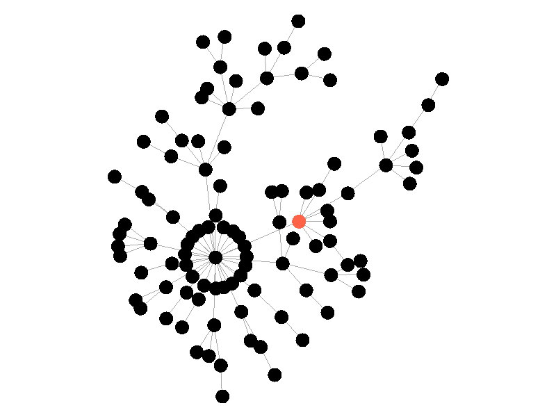

# Free/open network visualization tools

Slike omrežij iz orodij za analizo. Format ? 
  - bitna slika (polna BMP, PNG, Web / pozabljiva JPG) Irfanview, GIMP
  - opis sestave ( TikZ / TeX, EPS / GsView+Ghostscript, SVG / InkScape; 3D - VRML, MOL, X3D ) popravljanje dopolnjevanje slik iz orodij,
Nosilec: papir, zaslon, VR


  - [BMP](https://en.wikipedia.org/wiki/BMP_file_format) - bitmap
  - [GIF](https://en.wikipedia.org/wiki/GIF) -  Graphics Interchange Format
  - [PNG](https://en.wikipedia.org/wiki/PNG) -  Portable Network Graphics
  - [JPEG](https://en.wikipedia.org/wiki/JPEG) - Joint Photographic Experts Group
  - [WebP](https://en.wikipedia.org/wiki/WebP) - raster graphics file format by Google 

https://kurtjlewis.com/visualizing-epidemic-models-using-graphstream/

https://kateto.net/network-visualization




https://giphy.com/search/network
https://dribbble.com/shots/14400745-Networking


```
C <- c("CornflowerBlue","Lavender")
```


<hr />

[Index](README.md)
